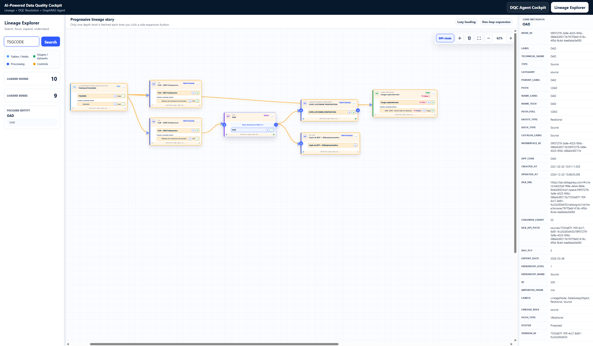

# Lineage Explorer User Guide

## Purpose

The Lineage Explorer helps a user understand how a catalog field travels through processing steps and reaches operational usages.

The interface loads the story progressively. A click reveals one new lineage hop, keeping the canvas readable and preventing unrelated downstream entities from appearing too early.

## Reference Screenshot



The orange highlight shows the visible lineage branch starting from the selected `TSGCODE` field. The screenshot includes:

- the `TSGCODE` field inside `TSIGNALETIQUEGEN`;
- the `CLB > OAD Forbearance` and `CLB > GDC Forbearance` processing cards;
- their DPI rows, displayed inside their parent processing cards;
- the `OAD` source;
- direct operational usage on the far right;
- additional OAD downstream processing cards revealed by the same one-hop source expansion.

The graph is not a single linear chain. It contains these distinct facts:

```text
Main processing branch:
TSGCODE
  -> CLB > OAD Forbearance / Element de traitement de donnees
  -> OAD source
  -> OAD : OAD - Outil d'aide a la decision

Usage containment:
Usages operationnels
  -> contains OAD : OAD - Outil d'aide a la decision

Additional stored shortcut:
TSGCODE
  -> is used by OAD : OAD - Outil d'aide a la decision
```

`Usages operationnels` is the parent folder of the concrete OAD usage. It is
displayed as one card with the OAD usage folded into a row. The direct
`TSGCODE -> OAD usage` shortcut is a separate field-level dependency; it does
not mean that `CLB` owns the usage folder.

## Start the Explorer

1. Run the backend:

   ```powershell
   uvicorn app.main:app --host 127.0.0.1 --port 8001 --reload
   ```

2. Run the frontend from `dqc_frontend_v3_datagalaxy_p`:

   ```powershell
   npm run dev -- --host 127.0.0.1 --port 5176
   ```

3. Open `http://127.0.0.1:5176`.
4. Select **Lineage Explorer** in the top-right workspace switcher.

## Demo: TSGCODE to Operational Usage

Several catalog fields share the name `TSGCODE`. For a reproducible demo, choose this exact path:

```text
\CLB\TRESIMMO\TSIGNALETIQUEGEN\TSGCODE
```

Its node identifier is:

```text
59f37279-3a9e-4025-956c-088a0c8f217d:6734e211-63f0-4390-ac39-a5be815b5af5
```

### 1. Search for the field

1. Enter `TSGCODE` in the left search box.
2. Select the result whose full path is `\CLB\TRESIMMO\TSIGNALETIQUEGEN\TSGCODE`.
3. Confirm that the center card shows `TSIGNALETIQUEGEN` with the selected `TSGCODE` field row.

For a faster demo, paste the node identifier instead of the field name. This returns the exact entity without requiring a path comparison.

### 2. Expand the first downstream hop

Click the green circular `+` on the `TSGCODE` row.

The explorer reveals the first demanded processing hop:

- `CLB > OAD Forbearance`
- `CLB > GDC Forbearance`

Each DPI remains folded into its parent processing card. This makes the relationship explicit without creating a separate floating card for every processing item.

### 3. Continue through the OAD branch

Inside `CLB > OAD Forbearance`, click the green circular `+` on the DPI row named `Element de traitement de donnees`.

The `OAD` source card appears as the next output.

### 4. Reveal the operational usage

Click the green downstream `+` on the `OAD` source card.

The rightmost usage card appears:

```text
Usages operationnels
  -> OAD : OAD - Outil d'aide a la decision
```

Usages stay on the right because they are terminal outcomes. When a source has a direct usage child, that usage is displayed immediately beside its parent source during the requested downstream hop.

The concrete OAD usage row has two relevant incoming dependency views:

- `OAD source -> OAD usage`, normalized by the backend from the stored usage-to-source relation;
- `TSGCODE -> OAD usage`, a direct field-level `IS_USED_BY` shortcut imported from the metadata.

The usage row remains folded into its `Usages operationnels` parent card in
both cases.

### 5. Highlight the visible branch

1. Click the `...` menu on the initial `TSGCODE` card.
2. Select **Highlight visible branch**.
3. Choose a highlight color.

The screenshot uses orange (`#F59E0B`) so the branch remains easy to follow across tables, processing cards, sources, and usages.

### 6. Explore upstream when needed

Use a blue circular `+` to reveal an upstream hop. The same one-hop rule applies in reverse.

This is useful when the starting point is a field discovered through search and the user wants to inspect its owner structure or earlier lineage stages.

## Catalog Expansion Inside a Source Card

Catalog browsing and lineage expansion are separate actions.

When starting from a source such as `CLB`:

1. Click **Show structures & fields (+)**.
2. Use the small square `+` beside a container such as `TRESIMMO`.
3. Use the small square `+` beside a structure such as `TSIGNALETIQUEGEN`.
4. Inspect the compact field rows inside the same source card.
5. Click the green circular `+` on a specific field only when downstream lineage is needed.

The wide source button never opens processing or usage cards. It strictly loads catalog containment rows.

## Button Reference

| Visual control | Action |
| --- | --- |
| Wide `Show structures & fields (+)` button | Load catalog containment inside a source card. |
| Wide `Hide structures & fields (-)` button | Hide loaded catalog rows without losing their loaded state. |
| Small square `+` | Show the children of a container or structure inside the current card. |
| Small square `-` | Fold nested catalog rows back into their parent row. |
| Blue circular `+` | Load one upstream lineage hop. |
| Blue circular `-` | Collapse an opened upstream branch. |
| Green circular `+` | Load one downstream lineage hop. |
| Green circular `-` | Collapse an opened downstream branch. |
| `Show more` | Reveal more already-loaded rows inside a crowded card. |
| `Show less` | Restore the compact row window. |
| `Load more structures & fields` | Request the next source-catalog page from the backend. |
| `...` | Open highlight and card actions. |

## Canvas Controls

| Control | Use |
| --- | --- |
| `DPI chain` | Keep the processing story readable by hiding shortcut edges when a DPI/DP bridge exists. |
| Crosshair icon | Fit the visible graph into the canvas. |
| Trash icon | Remove all active highlights. |
| Fullscreen icon | Enter or exit fullscreen mode. |
| `-` and `+` zoom controls | Zoom the canvas manually. |
| `Ctrl` + mouse wheel or touchpad gesture | Zoom around the pointer position. |
| Right-click drag | Pan across the canvas. |

Cards are repositioned dynamically as rows and branches expand. No card should overlap another card.

## Troubleshooting

### A search returns several fields with the same name

Use the full path or node identifier. For this guide, use:

```text
\CLB\TRESIMMO\TSIGNALETIQUEGEN\TSGCODE
```

### The interface reports a network or CORS error

Confirm that:

- the backend responds on `http://127.0.0.1:8001`;
- `.env` points `VITE_API_BASE_URL` to `http://127.0.0.1:8001`;
- the frontend is running on port `5176`.

### A structure contains many fields

Use `Show more` to reveal additional loaded rows. If the backend reports more catalog pages, use `Load more structures & fields`.

### A downstream card has not appeared yet

Click the green `+` on the specific row whose lineage you want to follow. The explorer intentionally does not open future hops automatically.
